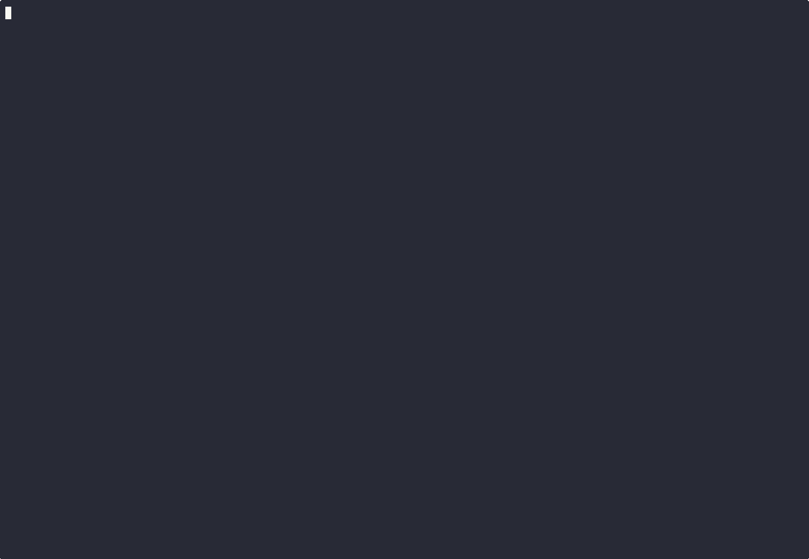

# Samaya


A minimal Pomodoro CLI timer for terminal environments with session tracking, ambient brown noise audio and session end bell. Completely local - no internet required, no data collection, full privacy.



## Usage

```bash
# Start preset sessions
samaya short    # 5 minutes
samaya medium   # 15 minutes  
samaya long     # 25 minutes

# Custom duration
samaya --time 10    # 10 minutes

# View session statistics
samaya stats

# Clear all session statistics
samaya stats --clear

# List available modes
samaya --list-modes

# Show version
samaya --version
```

## Features

- **Preset Sessions**: Three duration options (5, 15, 25 minutes)
- **Custom Duration**: Set any duration with `--time` flag
- **Background Brown Noise**: Ambient sound during sessions
- **Bell Notifications**: Audio alert when sessions complete
- **Session Tracking**: Automatic logging of completed sessions
- **Statistics**: View total sessions, time, and breakdown by type
- **Cross-platform**: Works on macOS, Linux, and Windows
- **Keyboard Control**: Stop sessions with Ctrl+C

## Installation

```bash
# Clone the repository
git clone https://github.com/SuryaWaters/samaya.git
cd samaya

# Install the package
pip install .
```

## Data Collection, Usage, and Retention

**Your privacy is important.** Samaya is designed with privacy in mind:

### What Data is Collected
- **Session logs that stays local**: Start times, durations, and session types (short/medium/long/custom)
- **Statistics**: Total session counts and time spent per session type
- **No personal data**: No names, emails, or identifying information

### Where Data is Stored
- **Local only**: All data is stored locally on your machine in `~/.samaya/`
- **No cloud sync**: Nothing is transmitted to external servers
- **No analytics**: No usage tracking or telemetry

### Data Usage
- **Statistics display**: Used only to show your session history via `samaya stats`
- **Session tracking**: Helps you monitor your productivity patterns
- **No third parties**: Data is never shared with anyone

### Data Retention
- **User controlled**: You can clear all data anytime with `samaya stats --clear`
- **Persistent**: Data remains until you manually delete it
- **Uninstall**: Remove `~/.samaya/` directory to delete all data

## License

This project is licensed under the MIT License - see the [LICENSE](LICENSE) file for details.
